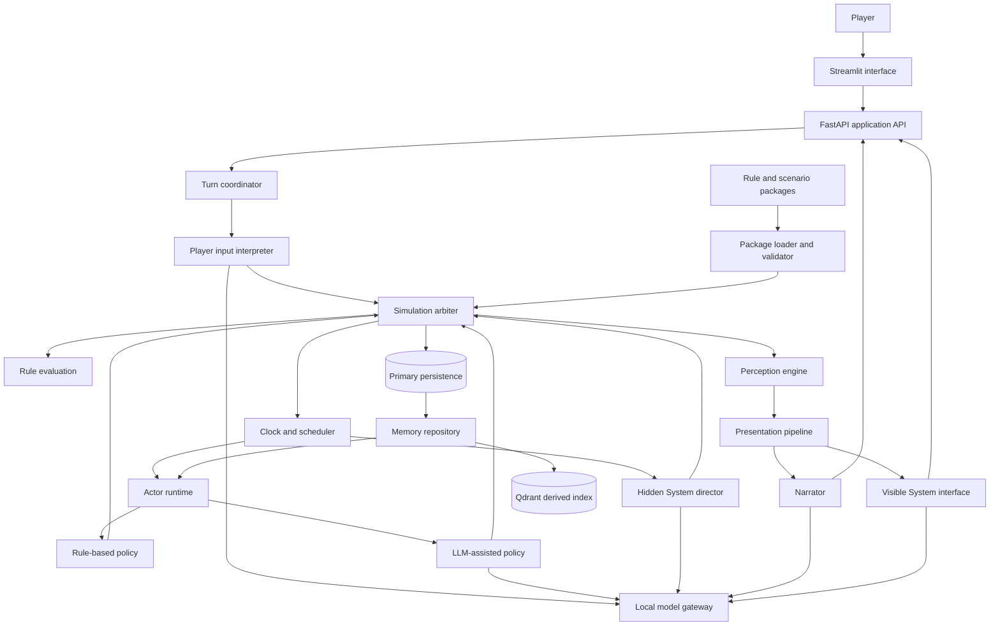

# High-Level Design

**Status:** Draft architecture based on accepted requirements and decisions as of 2026-07-11.

## Purpose

Build a persistent, inspectable Python simulation in which a human player and autonomous NPCs perceive limited information, form intentions, act through explicit rules, remember consequences, and receive a personal narrative through a Streamlit chat interface.

The project is also a laboratory for information architecture, context engineering, local LLM integration, agent design, and LLM-assisted programming.

This document consolidates the architecture. The non-normative [`domain guide`](domain_guide.md) provides orientation; canonical terminology belongs in [`glossary.md`](glossary.md), observable behavior belongs in [`requirements.md`](requirements.md), architectural rationale belongs in [`decisions.md`](decisions.md), the initial playable content belongs in [`initial_scenario.md`](initial_scenario.md), and postponed possibilities belong in [`ideas.md`](ideas.md).

## Core constraints

1. The simulation owns canonical truth.
2. LLMs interpret information, propose actions or events, and present confirmed outcomes.
3. Only the deterministic simulation arbiter may change canonical world state.
4. Every actor receives a bounded, role-specific view rather than complete world state.
5. World time advances through accepted actions or explicit waiting, not wall-clock time.
6. Game-specific mechanics and content live in versioned packages outside the stable kernel.
7. Derived indexes and generated prose are never authoritative data stores.
8. Each important stage must be inspectable and testable independently.

## Initial scope

The first vertical slice contains:

* one persistent world and one player;
* three connected locations;
* one rule-driven NPC and one LLM-assisted NPC;
* one scheduled environmental event;
* a hidden fact exposed through different character observations;
* one optional objective presented by the System interface;
* basic observation, movement, conversation, object interaction, helping, and waiting;
* one skill check and one visible progression event; and
* persistence across service restarts.

Combat, episodic memory retrieval, Qdrant integration, mutable belief state and belief revision, multiple worlds, real-time progression, GraphRAG, generated game packages, generated maps, and learning-mode evaluation are outside the initial scope.

The initial LLM-assisted NPC receives its identity, current perception, goals, and current plan. It does not receive prior conversation history as an undeclared substitute for memory, so the scenario must not depend on reliable recall across player turns.

## Logical architecture



The diagram shows logical responsibilities, not required deployment boundaries. The initial implementation can run them in one FastAPI process while keeping their interfaces separate.

## Component responsibilities

### Streamlit interface

* Displays narrated perceptions and distinct System notifications.
* Accepts free-form player thoughts and attempted actions.
* Shows progress and failures without claiming uncommitted outcomes.
* Provides a separate read-only development page for simulation-step inspection.
* Does not contain simulation or answer-generation business logic.

### FastAPI application API

* Provides the boundary used by Streamlit and development tools.
* Delegates complete simulation steps to the turn coordinator.
* Exposes world reset and inspection capabilities through explicit operations.
* Does not allow clients to write canonical state directly.

### Turn coordinator

* Loads the latest committed world and package versions.
* Coordinates interpretation, scheduling, proposals, resolution, perception, presentation, and persistence.
* Prevents partially completed steps from being presented as complete.
* Assigns a trace identifier to every attempted simulation step.

### Player input interpreter

* Separates explicit private thought from speech and attempted world actions.
* Maps free-form attempted actions to supported structured proposals.
* Requests clarification or reports unsupported attempts rather than inventing mechanics.
* Never decides the player's motives or whether an attempted action succeeds.

### Simulation arbiter

* Owns the canonical state-transition boundary.
* Validates proposals against current state and loaded rules.
* Resolves actions, produces outcomes, advances simulation time, and emits canonical events.
* Owns seeded randomness for explicit rule-governed checks and records every canonical draw.
* Begins that boundary with `draw_recorded_integer(request, source)`: one
  application-identified immutable request, one injected integer source that
  sees only strict inclusive bounds, and one immutable record preserving the
  validated result and exact audit metadata.
* Rejects invalid source values without clamping, coercion, retry, or a draw
  record, while preserving source-raised exceptions; concrete pseudorandom
  generation, state persistence, history attachment, and rule-check formulas
  remain later boundaries.
* Rejects unsupported or impossible operations without accepting generated narrative as fact.

### Clock and scheduler

* Maintains discrete simulation time.
* Makes NPCs, scheduled events, and System director hooks eligible when time advances.
* Purely partitions one validated activity queue at exact canonical world time
  through `select_eligible_activities(world, queue)`, including overdue and
  exactly due work while preserving strictly future work in storage order.
* Orders eligible work exactly by eligibility time, variant-derived phase rank,
  and stable insertion sequence; same-time environmental events precede NPC
  activities and System director hooks.
* Returns a self-validating immutable selection that retains exact activity
  objects and reuses the input queue when none are eligible.
* Submits activities serially and records their ordering metadata in the step trace.
* Does not run background ticks while awaiting player input.
* Keeps selection separate from claiming, persistence, execution, retries,
  recurrence, newly scheduled work, and world mutation.

### Perception engine

* Projects canonical state and events into actor-specific observations.
* Applies location, connection, visibility, capability, condition, and attention constraints.
* Produces structured perception snapshots for cognition and narration.
* Ensures feedback re-enters an actor through perception rather than direct outcome access.
* Begins with a pure current-state projection ordered as current location, authored outgoing connections, authored co-located other characters, and authored directly located or observer-possessed objects.
* Separately projects a caller-selected canonical-event batch into stateless self-action feedback after observer-first and whole-batch temporal validation; the actor or speaker owns an event, while witness rules, delivery tracking, and current-state composition remain outside this boundary.
* Separately projects addressed-speech recipient feedback through pure
  `project_addressed_speech_feedback(world, observer_id, events)` after the same
  observer-first and whole-batch temporal validation. A committed actor-spoke
  event's recipient identity proves delivery at occurrence time; present
  location and visual perception are not reapplied to historical speech, while
  candidate windows, delivery tracking, composition, ordering, and deduplication
  remain caller responsibilities.
* Separately projects immediate Take-witness feedback through pure
  `project_take_witness_feedback(world, observer_id, events)`. It requires an
  exact-current-time candidate batch and matches only non-actors co-located with
  an object-taken event's previous location, preserving the exact event without
  rechecking current object state. Historical reconstruction, richer visibility,
  composition, delivery tracking, reactions, memory, and presentation remain
  outside this boundary.
* Separately projects immediate third-party speech-overhearing feedback through
  pure `project_speech_overhearing_feedback(world, observer_id, events)`. After
  observer-first and exact-current-time batch validation, it validates every
  speech event's speaker before filtering and matches only an observer who is
  neither speaker nor addressed recipient at the speaker's exact current
  canonical location. Historical reconstruction, recipient revalidation,
  comprehension, reactions, richer hearing mechanics, composition, delivery
  tracking, memory, and presentation remain outside this boundary.

### Actor runtime

* Builds bounded decision context from identity, goals, plans, current perception, beliefs, and selected memories.
* Runs the configured rule-based, scripted, LLM-assisted, or hybrid policy.
* Produces structured intentions and action proposals only.
* Records observations and, after the vertical slice, manages validated belief or appraisal updates separately from canonical state.

### System director

* Acts as the hidden creative portion of a game master.
* Is invoked only when a package-configured hook becomes eligible through world creation, a matching canonical event, a scenario milestone, or elapsed simulation time.
* Applies hook-specific simulation-time frequency or count limits and records each eligibility reason.
* Receives a curated world-level context after eligibility is established.
* Proposes complications, opportunities, objectives, or supported world events.
* Cannot execute proposals, rewrite rules during play, or communicate mechanical facts directly to the player.

### Presentation pipeline

* Gives the narrator only the player's structured perception snapshot.
* Gives the visible System interface only arbiter-confirmed notification payloads.
* Allows LLM-generated style without allowing factual changes.
* Keeps ordinary world narration distinct from diegetic System notifications.

### Package loader and validator

* Safely parses YAML rule and scenario packages into strict Pydantic models.
* Discovers self-contained exact versions below `game_packages/rules/` and `game_packages/scenarios/`.
* Validates a shared manifest identity envelope and preserves exact scenario-to-rule-pack pins without resolving them during single-package loading.
* Confirms that manifest identity matches its directory and that its single YAML entrypoint resolves to a regular file inside that package directory.
* Uses validated manifest type as the sole entrypoint-schema selector and returns one immutable typed manifest-definition pair only after both documents validate.
* Exposes one complete-package loading function and one game-package loading error rather than exposing partial manifests, raw mappings, or validation-library exceptions.
* Semantically validates one loaded rule-and-scenario pair through deterministic dependency, namespace-uniqueness, reference, player-count, and player-rooted directed-reachability checks.
* Aggregates independent semantic defects as ordered structured validation issues while gating checks whose prerequisites are invalid.
* Keeps policy implementation availability, supported operations, persistent-world compatibility, and final world-creation readiness as later explicit boundaries.
* Records exact package identities and versions in world metadata.
* Requires reset or explicit migration for incompatible package changes.
* Rejects executable YAML constructs and never exposes raw package mappings to simulation logic.

### Model gateway

* Provides one application-owned interface to the local OpenAI-compatible LLM and embedding services.
* Applies role-specific prompts, structured-output schemas, timeouts, and error handling.
* Disables Gemma thinking for functional roles with `chat_template_kwargs.enable_thinking=false` and never treats `reasoning_content` as functional output.
* Validates functional outputs through strict Pydantic models and permits at most one schema-guided repair attempt.
* Produces role-specific clarification, fallback, no-op, or skip results after failed repair.
* Records original output, validation errors, repair output, and final disposition in the simulation-step trace.
* Keeps provider details outside simulation and actor-domain logic.
* Makes LLM calls replaceable by deterministic fakes in tests.

## Information architecture

### Authoritative and derived information

| Information | Owner | Authority |
| --- | --- | --- |
| World state, simulation time, entities, locations | Primary persistence through the arbiter | Canonical |
| Committed events and outcomes | Primary persistence through the arbiter | Canonical |
| Character observations and episodic memories | Primary persistence through the memory repository | Authoritative character history |
| Character beliefs and appraisals | Primary persistence through the actor runtime | Authoritative only for that character's internal state |
| Rule and scenario package source | Versioned package files | Authoritative definitions |
| Vector embeddings and Qdrant collections | Rebuildable indexer | Derived |
| LLM proposals and validation results | Step trace | Evidence, not canonical until resolved |
| Narration and styled System notifications | Presentation trace | Derived presentation |

### Principal records

The design requires stable identifiers and explicit schemas for these concepts:

* `World`: package versions, simulation time, lifecycle metadata.
* `LocationDefinition`, `ConnectionDefinition`, and `SpatialGraphDefinition`: immutable authored topology with directed edges and integer-second base traversal durations.
* `LocationState` and `ConnectionState`: mutable canonical availability, conditions, requirements, and other runtime facts, defined separately from package topology.
* `ObjectDefinition`, `PlayerCharacterDefinition`, `NpcCharacterDefinition`, and `EntityCollectionDefinition`: immutable authored inhabitants, archetype references, initial placement, and NPC motivation context.
* `ObjectArchetypeDefinition`, `CharacterArchetypeDefinition`, `DecisionPolicyDefinition`, `ObjectUseMechanicDefinition`, and `RulePackDefinition`: immutable rule-pack catalogs. Initial Use mechanics declare only a required object archetype, location target, duration, and closed boolean-world-fact effect kind; executable callbacks and arbitrary effect data remain prohibited.
* `ScenarioPackDefinition`, `BooleanWorldFactDefinition`, and `ObjectUseBindingDefinition`: immutable scenario content that composes spatial topology and inhabitants and binds reusable Use mechanics to concrete object, location, and fact identities.
* `LoadedRulePackage` and `LoadedScenarioPackage`: immutable structurally trusted manifest-definition pairs returned by complete single-package loading before dependency and semantic validation.
* `ValidationIssue` and `GamePackageValidationError`: immutable deterministic semantic authoring feedback with stable codes and authored-field paths.
* `ValidatedGamePackages`: immutable loaded rule-and-scenario pair after dependency, uniqueness, reference, player-count, and topology validation, but before implementation-registry and world-readiness checks.
* `EntityState` and `CharacterState`: mutable canonical placement, possession, condition, goals, plans, and references to character-specific internal state, defined separately from package records.
* `WorldState`: an immutable validated snapshot containing only changing facts linked by stable IDs to immutable validated package definitions. It includes simulation time plus character location, object placement or possession, connection availability, and strict boolean-world-fact overlays without copying authored names, topology, traversal durations, archetypes, or goals. The arbiter applies a complete typed change set to produce a replacement snapshot rather than mutating its input in place.
* World readiness: a semantic boundary comparing one runtime snapshot with its validated package pair. It proves complete one-to-one character, object, connection, and boolean-world-fact overlays plus identifier and reference validity; structural state construction alone does not make this claim.
* `ValidatedWorldState`: the immutable successful result of that boundary, pairing validated package definitions with their relationally coherent runtime snapshot. The arbiter consumes this wrapper, but it does not claim policy-registry, mechanics, persistence, or playability readiness.
* Runtime collections: immutable ordered tuples preserve deterministic serialization and world-creation order. Semantic validation and resolution remain order-independent and may build temporary identifier indexes.
* Initial runtime variants: character state has current location; object state has exactly one location-or-possessor placement; connection state has explicit availability; boolean world facts have strict values; and world state has non-negative integer simulation time. Absence, destruction, consumption, quantities, richer conditions, and nested containment require later explicit mechanics.
* State changes: a closed union of self-verifying deltas with explicit before and after values for character location, object placement, connection availability, boolean world facts, or simulation time. They describe snapshot replacement inputs, not canonical events.
* `ActionProposal`: an untrusted closed discriminated union with one strict argument contract per supported operation and no caller-controlled identity or provenance metadata.
* `ActionProposalSubmission`: a trusted application-created envelope containing proposal identity, source role and identity, intended actor when applicable, simulation-step context, and trace provenance. Actor-action and world-action submissions form separate typed families.
* Runtime identity and proposal source: application-injected UUIDs identify proposals and simulation steps, while a discriminated source union carries role-specific provenance. Authored package identifiers remain readable domain strings.
* Operation references: namespace-aware typed references constrained per operation. Movement selects an authored directed connection; observation distinguishes surroundings from location, connection, character, and object targets.
* Actor-action operation dispatch: a pure post-authorization, pre-resolution routing boundary that selects implemented resolvers by concrete proposal type and forwards caller-injected outcome and event identities. Move, Wait, Observe, Speak, Take, and Use have concrete resolvers; Help retains a typed unavailable-capability error rather than producing a canonical outcome.
* Bound Use resolution: a pure deterministic operation boundary that selects one validated scenario binding by exact object and location target, resolves its rule-pack mechanic, checks current actor co-location and object possession, and applies only the bound boolean-fact effect over the authored duration. It produces typed changes and one canonical event but does not commit, consume the object, run checks, execute newly eligible activities, or infer downstream scenario consequences.
* `Outcome`: a closed union of immutable rejected, failed, and succeeded results with outcome and proposal identities plus a stable reason code. Rejected outcomes have no effect fields; failed and succeeded outcomes carry ordered typed state-change and canonical-event tuples that may be empty.
* `OutcomeCommitResult`: the immutable result of atomically committing one structurally valid outcome against `ValidatedWorldState`, containing the exact outcome and resulting validated world without duplicating its event tuple.
* Outcome time: each outcome has one atomic completion timestamp. Nested events share that time and causation identity; elapsed-time-triggered activities resolve separately after the triggering action.
* Outcome reason codes: strict kebab-case machine values whose meanings are owned by deterministic resolvers rather than one central enum, generated prose, or package strings.
* `IntegerDrawRequest`: a strict immutable application-identified request with
  an extensible kebab-case purpose and strict inclusive integer bounds containing
  at least two possible results.
* `IntegerRandomSource`: an injected protocol exposing one keyword-only bounded
  integer operation. It receives no identity, purpose, rule, outcome, or trace
  context, so audit metadata cannot influence entropy generation.
* `IntegerDrawRecord`: the strict immutable successful result preserving the
  request's exact identity, purpose, and bounds plus one validated strict integer
  result. Invalid returned values raise `RandomSourceContractError`; exceptions
  raised by the source propagate unchanged. The record does not itself claim
  persistence or attachment to an outcome, event, or simulation-step trace.
* `Event`: a closed discriminated union of canonical domain facts with stable identity, simulation time, causation, and event-specific payload. Events do not contain narration or observer visibility and are durable history rather than the sole world-state persistence mechanism.
* Initial event variants: actor observed, moved, spoke, helped, waited, or failed an action; and an object was taken or used. Their payloads reuse typed targets and placements where applicable.
* `Observation`: a closed union of observer-specific location, connection, character, object, or canonical-event facts with observation time and fixed current-state or event provenance. Initial transient observations are ID-linked and have no generated observation UUID, confidence score, or salience score.
* `PerceptionSnapshot`: one observer's immutable ordered observations at one simulation time, with envelope identity and time required to match every contained item. It may be empty and does not itself prove world-aware perceptual filtering.
* Current-state perception projection: a pure `ValidatedWorldState` view that uses canonical time and authored ordering, raises a typed caller error for a missing character observer, exposes unavailable outgoing connections as unavailable, excludes incoming-only connections and other actors' possessions, and emits no event observations.
* Self-action event feedback projection: a pure event-observation fragment that resolves the observer in the character-state namespace, rejects the first future event before ownership filtering, and preserves exact matching event objects, order, and duplicates. The caller owns candidate-window and delivery tracking; recipients, targets, assisted characters, objects, possession, proximity, general witness rules, and current-state composition do not affect self ownership.
* Addressed-speech feedback projection: a pure event-observation fragment that
  reuses observer-first and whole-batch temporal validation, then preserves exact
  actor-spoke events addressed to the observer in input order with duplicates.
  It does not recheck current locations or visual perception, compose self or
  current-state feedback, track delivery, infer comprehension, or invoke a
  response.
* Take-witness feedback projection: a pure immediate event-observation fragment
  that validates the observer before requiring every candidate event time to
  equal current canonical time. It preserves exact object-taken events for
  non-acting observers whose current location equals the event's exact previous
  object location. It does not recheck current object placement, reconstruct
  historical locations, add richer visibility, compose fragments, track
  delivery, or trigger reactions.
* Focused Observe resolver: a pure zero-time boundary that projects the authorized actor's current perception, treats surroundings as perceptible, and otherwise accepts only matching typed current-state observation membership. Success records one actor-observed event without state changes; every absent specific target rejects uniformly without canonical-existence disclosure. Rich inspection, checks, enrichment, event feedback, and observation recording remain outside Observe v0.
* Speak v0 resolver: a pure zero-time boundary that treats only another character
  at the authorized speaker's exact canonical location as audible. Every unknown,
  remote, self, or wrong-namespace recipient rejects uniformly without effects;
  success records the exact addressed utterance in one actor-spoke event without
  claiming comprehension, response, memory, belief, recipient feedback, or
  visual perceptibility.
* Take v0 resolver: a pure zero-time boundary that authorizes acquisition only
  when canonical runtime state places the object directly at the authorized
  actor's exact location. Every unknown, remote, possessed, or wrong-namespace
  object rejects uniformly without effects; success transfers the exact previous
  location placement to actor possession and records one object-taken event.
  Perception, transfer, theft, consent, carrying limits, checks, witness feedback,
  responses, commitment, and presentation remain separate.
* `EpisodicMemory`: durable character history derived from observations.
* `Belief`: character-held claim with confidence, provenance, and revision state.
* `ScheduledActivity`: a closed union of strict immutable one-shot
  `EnvironmentalScheduledActivity`, `NpcScheduledActivity`, and
  `SystemDirectorScheduledActivity` eligibility records. Every occurrence has an
  application-assigned UUID, non-negative integer eligibility time, and unique
  caller-assigned non-negative insertion sequence; the variants respectively
  reference an authored schedule, NPC, or System director hook. Phase order is
  derived from the variant as environmental, NPC, then System director rather
  than stored on the record. `ScheduledActivityQueue` preserves an immutable
  supplied tuple order, normalizes serialized lists, and rejects duplicate
  activity identities and insertion sequences while allowing equal times and
  storage order unrelated to execution order. `ScheduledActivitySelection` is
  the strict immutable result of pure canonical-time partitioning: it contains
  selection time, due activities ordered by time, derived phase, and insertion
  sequence, and a remaining strictly future queue in original storage order. It
  validates those invariants plus metadata uniqueness across both groups,
  retains exact activity objects, and reuses the input queue when none are due.
  Structural records and selection do not resolve authored references, claim,
  execute, recur, retry, cancel, persist, or mutate scheduled work or world
  state; package validation, execution coordination, and persistence remain
  separate boundaries.
* `SystemNotification`: arbiter-confirmed mechanical payload and visibility.

Exact Python models and storage representation remain implementation decisions. These conceptual boundaries must remain visible even if several records initially share one database table or document.

### Context envelopes

Every LLM call receives a role-specific context envelope. A context envelope should identify:

* role and actor, if any;
* simulation time and step trace;
* current structured perception or curated world summary;
* selected goals, plans, beliefs, and memories appropriate to the role;
* allowed operations and required output schema;
* package versions; and
* provenance references for included information.

Context assembly is an application capability, not prompt-string concatenation scattered across components. A development trace should make included and excluded sources inspectable.

### Post-slice memory retrieval

When episodic memory is enabled after the vertical slice, NPC context uses a bounded hybrid policy. Configured high-salience memories, recent memories, and semantically relevant Qdrant results compete for explicit source and total context budgets. Results are filtered by NPC ownership, deduplicated, and retain stable identifiers and provenance.

Qdrant failure falls back to recent and high-salience records from primary persistence. It reduces semantic recall quality but does not prevent NPC decisions or erase history.

## Actor loop

```text
Canonical reality and events
        -> perceptual filtering
        -> observations and episodic memory
        -> sensemaking, beliefs, and appraisal
        -> intent
        -> structured action proposal
        -> arbiter validation and resolution
        -> outcome, state transition, and events
        -> perceptual filtering for every observer
```

Different limitations belong at different stages. Sensory capability shapes perception; knowledge and memory shape sensemaking; goals and values shape intent; skills and resources constrain actions; rules and opposition determine outcomes.

For the player, human cognition replaces NPC sensemaking and intent selection. The application filters what the player can perceive, interprets explicitly supplied input, and resolves attempted actions, but does not invent player motives.

## Simulation-step flow

1. Receive player text against the latest committed world version.
2. Interpret explicit thoughts, speech, and attempted actions into a structured input result.
3. Validate the player proposal. Pure thought does not advance time.
4. Resolve an accepted consequential action and advance time by its duration.
5. Ask the scheduler to partition due activities at canonical world time and
   return them in deterministic order without executing or persisting them.
6. Build bounded contexts and obtain NPC or System director action proposals as required.
7. Validate and resolve each proposal through the arbiter.
8. Produce observations for every affected observer. After the vertical slice, episodic memory and belief revisions use their own validated boundaries.
9. Derive the player's perception snapshot and confirmed System notifications.
10. Persist canonical transitions, event history, character information, and step trace before reporting completion.
11. Narrate the committed perception and style confirmed System notifications for Streamlit.

If a functional LLM output fails schema validation, the model receives at most one repair attempt using the same context envelope, schema, and validation errors. A second failure asks the player for clarification, applies the NPC's configured safe no-op or deterministic fallback, or skips the System director action proposal. Invalid prose is never mined for canonical operations. Presentation failure must not undo an already committed simulation step; presentation can be regenerated from committed facts.

## Persistence and consistency

SQLite is the authoritative store for the initial local, single-world deployment. A completed simulation step commits its canonical transitions, events, character information, and trace atomically so partially committed outcomes cannot be presented as complete. The world records the package versions under which it runs.

Qdrant stores only rebuildable retrieval projections. Losing the vector collection may reduce memory retrieval quality temporarily but must not erase character history.

Repository boundaries keep domain logic independent of SQLite details and preserve a migration path if later concurrency requirements justify a different database.

## Randomness and replay

Rules are deterministic unless they explicitly request an uncertain check. The arbiter owns the world pseudorandom generator, persists its seed and state, and records each draw's purpose, parameters, and result with the resolved event. LLM output never substitutes for a canonical draw.

Replaying committed proposals with recorded draws reproduces canonical resolution even if model output or a future pseudorandom implementation differs. Unit tests inject specified draw results; seeded end-to-end flows test integration without making exact generator sequences a domain contract.

## Observability and evaluation

Every attempted step should be inspectable as a causal chain:

```text
player input
  -> interpretation
  -> context manifests
  -> actor and System director action proposals
  -> validation and resolution
  -> state transitions and events
  -> observations and memory changes
  -> player perception
  -> narration and System notifications
```

Development tooling should prioritize answering:

* What did each actor know?
* Why was an actor eligible to act?
* What did an LLM propose?
* Which rule accepted or rejected it?
* What changed canonically?
* What did each observer perceive?
* Which facts reached the final narration?

This trace supports debugging, context-engineering experiments, deterministic replay of the non-LLM stages, and later decision-making debriefs.

The initial inspection interface is a separate read-only Streamlit page. It presents an ordered simulation-step timeline with expandable stage records and supports side-by-side comparison of canonical world state with a selected character's perception snapshot. It exposes stable identifiers and provenance but cannot edit state; reset remains an explicit development operation.

## Testing strategy

Follow test-driven development at each boundary:

* Pure kernel tests verify actions, time, scheduling, graph traversal, and perception without an LLM.
* Resolution tests inject explicit random results for success, failure, and boundary behavior.
* Package contract tests reject invalid schemas, references, operations, and unreachable required locations.
* Decision-policy contract tests verify that every policy returns proposals and cannot mutate state.
* Context tests verify inclusion, exclusion, provenance, and information boundaries.
* Persistence tests verify restart recovery and rejection of partial steps.
* Integration tests use deterministic fake model responses.
* A small opt-in end-to-end test exercises the deployed local models without making the normal test suite nondeterministic.

Tests should assert structured behavior and canonical facts, not exact generated prose.

## Implementation sequence

[`roadmap.md`](roadmap.md) owns detailed dependency order and task readiness. The sequence below remains the architectural milestone view.

1. Define package and domain schemas through failing contract tests.
2. Implement the pure simulation kernel, clock, location graph, actions, events, and perception.
3. Add primary persistence, restart recovery, reset, and step traces.
4. Add the FastAPI turn boundary and a minimal Streamlit client using deterministic presentation.
5. Add the rule-driven NPC and the complete scheduled actor loop.
6. Add the model gateway, player interpreter, memory-free LLM-assisted NPC, and narrator.
7. Add the hidden System director, visible System interface, skill check, and progression event.
8. Validate the complete vertical slice before adding episodic memory retrieval or promoting any backlog idea.

## Open design choices

No unresolved high-level design choices currently block decomposition of the initial vertical slice. Implementation may expose narrower contract questions, which must be resolved through requirements and decisions rather than silently assumed.
