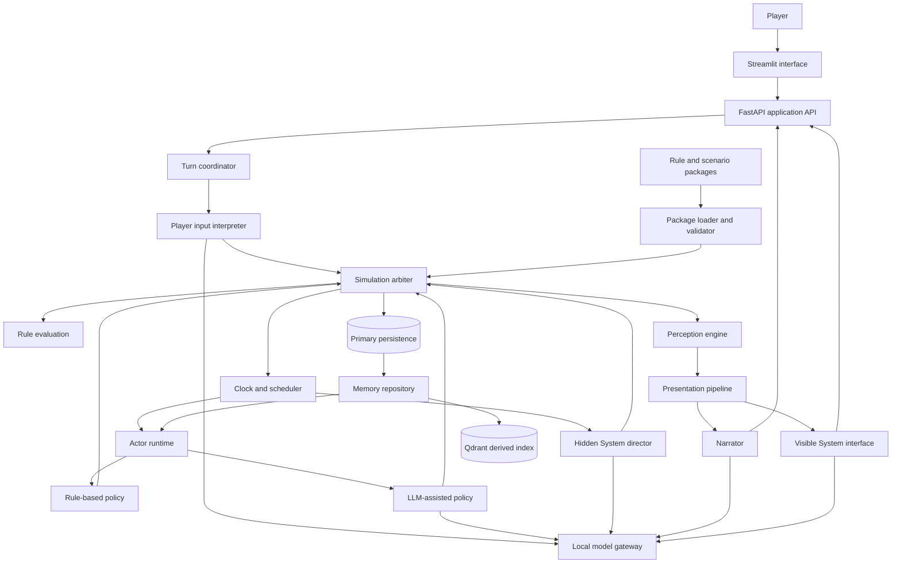

# High-Level Design

**Status:** Draft architecture based on accepted requirements and decisions as of 2026-07-11.

## Purpose

Build a persistent, inspectable Python simulation in which a human player and autonomous NPCs perceive limited information, form intentions, act through explicit rules, remember consequences, and receive a personal narrative through a Streamlit chat interface.

The project is also a laboratory for information architecture, context engineering, local LLM integration, agent design, and LLM-assisted programming.

This document consolidates the architecture. Canonical terminology belongs in [`glossary.md`](glossary.md), observable behavior belongs in [`requirements.md`](requirements.md), architectural rationale belongs in [`decisions.md`](decisions.md), and postponed possibilities belong in [`ideas.md`](ideas.md).

## Core constraints

1. The simulation owns canonical truth.
2. LLMs interpret information, propose actions or events, and present confirmed outcomes.
3. Only the deterministic simulation arbiter may change canonical world state.
4. Every actor receives a bounded, role-specific view rather than complete world state.
5. World time advances through accepted actions or explicit waiting, not wall-clock time.
6. Game-specific mechanics and content live in versioned packages outside the stable kernel.
7. Derived indexes and generated prose are never authoritative data stores.
8. Each important stage must be inspectable and testable independently.

## Initial scope

The first vertical slice contains:

* one persistent world and one player;
* three connected locations;
* one rule-driven NPC and one LLM-assisted NPC;
* one scheduled environmental event;
* incomplete or mistaken character knowledge;
* one optional objective presented by the System interface;
* basic observation, movement, conversation, object interaction, helping, and waiting;
* one skill check and one visible progression event; and
* persistence across service restarts.

Combat, multiple worlds, real-time progression, GraphRAG, generated game packages, generated maps, and learning-mode evaluation are outside the initial scope.

## Logical architecture



The diagram shows logical responsibilities, not required deployment boundaries. The initial implementation can run them in one FastAPI process while keeping their interfaces separate.

## Component responsibilities

### Streamlit interface

* Displays narrated perceptions and distinct System notifications.
* Accepts free-form player thoughts and attempted actions.
* Shows progress and failures without claiming uncommitted outcomes.
* Does not contain simulation or answer-generation business logic.

### FastAPI application API

* Provides the boundary used by Streamlit and development tools.
* Delegates complete simulation steps to the turn coordinator.
* Exposes world reset and inspection capabilities through explicit operations.
* Does not allow clients to write canonical state directly.

### Turn coordinator

* Loads the latest committed world and package versions.
* Coordinates interpretation, scheduling, proposals, resolution, perception, presentation, and persistence.
* Prevents partially completed steps from being presented as complete.
* Assigns a trace identifier to every attempted simulation step.

### Player input interpreter

* Separates explicit private thought from speech and attempted world actions.
* Maps free-form attempted actions to supported structured proposals.
* Requests clarification or reports unsupported attempts rather than inventing mechanics.
* Never decides the player's motives or whether an attempted action succeeds.

### Simulation arbiter

* Owns the canonical state-transition boundary.
* Validates proposals against current state and loaded rules.
* Resolves actions, produces outcomes, advances simulation time, and emits canonical events.
* Owns seeded randomness for explicit rule-governed checks and records every canonical draw.
* Rejects unsupported or impossible operations without accepting generated narrative as fact.

### Clock and scheduler

* Maintains discrete simulation time.
* Makes NPCs, scheduled events, and System director hooks eligible when time advances.
* Orders eligible work by simulation time, phase priority, and stable insertion sequence.
* Resolves same-time environmental events before NPC activities and System director hooks.
* Submits activities serially and records their ordering metadata in the step trace.
* Does not run background ticks while awaiting player input.

### Perception engine

* Projects canonical state and events into actor-specific observations.
* Applies location, connection, visibility, capability, condition, and attention constraints.
* Produces structured perception snapshots for cognition and narration.
* Ensures feedback re-enters an actor through perception rather than direct outcome access.

### Actor runtime

* Builds bounded decision context from identity, goals, plans, current perception, beliefs, and selected memories.
* Runs the configured rule-based, scripted, LLM-assisted, or hybrid policy.
* Produces structured intentions and action proposals only.
* Records observations and manages belief or appraisal updates separately from canonical state.

### System director

* Acts as the hidden creative portion of a game master.
* Is invoked only when a package-configured hook becomes eligible through world creation, a matching canonical event, a scenario milestone, or elapsed simulation time.
* Applies hook-specific simulation-time frequency or count limits and records each eligibility reason.
* Receives a curated world-level context after eligibility is established.
* Proposes complications, opportunities, objectives, or supported world events.
* Cannot execute proposals, rewrite rules during play, or communicate mechanical facts directly to the player.

### Presentation pipeline

* Gives the narrator only the player's structured perception snapshot.
* Gives the visible System interface only arbiter-confirmed notification payloads.
* Allows LLM-generated style without allowing factual changes.
* Keeps ordinary world narration distinct from diegetic System notifications.

### Package loader and validator

* Safely parses YAML rule and scenario packages into strict Pydantic models.
* Validates schema, references, graph connectivity, supported operations, and compatibility before use.
* Records exact package identities and versions in world metadata.
* Requires reset or explicit migration for incompatible package changes.
* Rejects executable YAML constructs and never exposes raw package mappings to simulation logic.

### Model gateway

* Provides one application-owned interface to the local OpenAI-compatible LLM and embedding services.
* Applies role-specific prompts, structured-output schemas, timeouts, and error handling.
* Keeps provider details outside simulation and actor-domain logic.
* Makes LLM calls replaceable by deterministic fakes in tests.

## Information architecture

### Authoritative and derived information

| Information | Owner | Authority |
| --- | --- | --- |
| World state, simulation time, entities, locations | Primary persistence through the arbiter | Canonical |
| Committed events and outcomes | Primary persistence through the arbiter | Canonical |
| Character observations and episodic memories | Primary persistence through the memory repository | Authoritative character history |
| Character beliefs and appraisals | Primary persistence through the actor runtime | Authoritative only for that character's internal state |
| Rule and scenario package source | Versioned package files | Authoritative definitions |
| Vector embeddings and Qdrant collections | Rebuildable indexer | Derived |
| LLM proposals and validation results | Step trace | Evidence, not canonical until resolved |
| Narration and styled System notifications | Presentation trace | Derived presentation |

### Principal records

The design requires stable identifiers and explicit schemas for these concepts:

* `World`: package versions, simulation time, lifecycle metadata.
* `Location` and `Connection`: graph topology, traversal requirements, duration, state.
* `Entity` and `Character`: canonical physical state and references to character-specific state.
* `ActionProposal`: actor, intent, supported operation, arguments, and context trace.
* `Outcome` and `Event`: resolution result, state changes, time, participants, and provenance.
* `Observation`: observer-specific perceived facts, source event, time, confidence, and salience.
* `EpisodicMemory`: durable character history derived from observations.
* `Belief`: character-held claim with confidence, provenance, and revision state.
* `ScheduledActivity`: eligibility time, owner, operation, and ordering metadata.
* `SystemNotification`: arbiter-confirmed mechanical payload and visibility.

Exact Python models and storage representation remain implementation decisions. These conceptual boundaries must remain visible even if several records initially share one database table or document.

### Context envelopes

Every LLM call receives a role-specific context envelope. A context envelope should identify:

* role and actor, if any;
* simulation time and step trace;
* current structured perception or curated world summary;
* selected goals, plans, beliefs, and memories appropriate to the role;
* allowed operations and required output schema;
* package versions; and
* provenance references for included information.

Context assembly is an application capability, not prompt-string concatenation scattered across components. A development trace should make included and excluded sources inspectable.

## Actor loop

```text
Canonical reality and events
        -> perceptual filtering
        -> observations and episodic memory
        -> sensemaking, beliefs, and appraisal
        -> intent
        -> structured action proposal
        -> arbiter validation and resolution
        -> outcome, state transition, and events
        -> perceptual filtering for every observer
```

Different limitations belong at different stages. Sensory capability shapes perception; knowledge and memory shape sensemaking; goals and values shape intent; skills and resources constrain actions; rules and opposition determine outcomes.

For the player, human cognition replaces NPC sensemaking and intent selection. The application filters what the player can perceive, interprets explicitly supplied input, and resolves attempted actions, but does not invent player motives.

## Simulation-step flow

1. Receive player text against the latest committed world version.
2. Interpret explicit thoughts, speech, and attempted actions into a structured input result.
3. Validate the player proposal. Pure thought does not advance time.
4. Resolve an accepted consequential action and advance time by its duration.
5. Ask the scheduler for newly eligible activities in deterministic order.
6. Build bounded contexts and obtain NPC or System director action proposals as required.
7. Validate and resolve each proposal through the arbiter.
8. Produce observations for every affected observer and update character memories or beliefs through their own boundary.
9. Derive the player's perception snapshot and confirmed System notifications.
10. Persist canonical transitions, event history, character information, and step trace before reporting completion.
11. Narrate the committed perception and style confirmed System notifications for Streamlit.

If interpretation fails, the application asks for clarification without advancing time. If an NPC or System director LLM call fails, an explicit policy selects a retry, rule-based fallback, or no-op. Presentation failure must not undo an already committed simulation step; presentation can be regenerated from committed facts.

## Persistence and consistency

SQLite is the authoritative store for the initial local, single-world deployment. A completed simulation step commits its canonical transitions, events, character information, and trace atomically so partially committed outcomes cannot be presented as complete. The world records the package versions under which it runs.

Qdrant stores only rebuildable retrieval projections. Losing the vector collection may reduce memory retrieval quality temporarily but must not erase character history.

Repository boundaries keep domain logic independent of SQLite details and preserve a migration path if later concurrency requirements justify a different database.

## Randomness and replay

Rules are deterministic unless they explicitly request an uncertain check. The arbiter owns the world pseudorandom generator, persists its seed and state, and records each draw's purpose, parameters, and result with the resolved event. LLM output never substitutes for a canonical draw.

Replaying committed proposals with recorded draws reproduces canonical resolution even if model output or a future pseudorandom implementation differs. Unit tests inject specified draw results; seeded end-to-end flows test integration without making exact generator sequences a domain contract.

## Observability and evaluation

Every attempted step should be inspectable as a causal chain:

```text
player input
  -> interpretation
  -> context manifests
  -> actor and System director action proposals
  -> validation and resolution
  -> state transitions and events
  -> observations and memory changes
  -> player perception
  -> narration and System notifications
```

Development tooling should prioritize answering:

* What did each actor know?
* Why was an actor eligible to act?
* What did an LLM propose?
* Which rule accepted or rejected it?
* What changed canonically?
* What did each observer perceive?
* Which facts reached the final narration?

This trace supports debugging, context-engineering experiments, deterministic replay of the non-LLM stages, and later decision-making debriefs.

## Testing strategy

Follow test-driven development at each boundary:

* Pure kernel tests verify actions, time, scheduling, graph traversal, and perception without an LLM.
* Resolution tests inject explicit random results for success, failure, and boundary behavior.
* Package contract tests reject invalid schemas, references, operations, and unreachable required locations.
* Decision-policy contract tests verify that every policy returns proposals and cannot mutate state.
* Context tests verify inclusion, exclusion, provenance, and information boundaries.
* Persistence tests verify restart recovery and rejection of partial steps.
* Integration tests use deterministic fake model responses.
* A small opt-in end-to-end test exercises the deployed local models without making the normal test suite nondeterministic.

Tests should assert structured behavior and canonical facts, not exact generated prose.

## Implementation sequence

1. Define package and domain schemas through failing contract tests.
2. Implement the pure simulation kernel, clock, location graph, actions, events, and perception.
3. Add primary persistence, restart recovery, reset, and step traces.
4. Add the FastAPI turn boundary and a minimal Streamlit client using deterministic presentation.
5. Add the rule-driven NPC and the complete scheduled actor loop.
6. Add the model gateway, player interpreter, LLM-assisted NPC, memory retrieval, and narrator.
7. Add the hidden System director, visible System interface, skill check, and progression event.
8. Validate the complete vertical slice before promoting any backlog idea.

## Open design choices

The following choices remain unresolved and must be considered separately:

* the fiction and exact stakes of the first scenario;
* belief-revision ownership and rules;
* context budgets and episodic-memory retrieval policy;
* structured-output behavior of the deployed local model; and
* the first development inspection interface.
